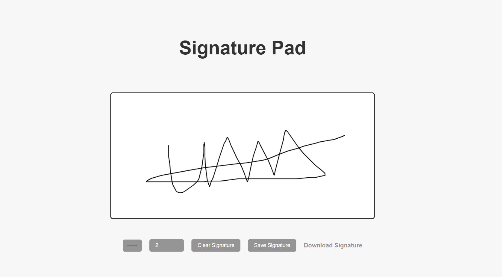

# Signature Pad Website

Welcome to the Signature Pad Website! This project provides a simple and intuitive interface for users to create, save, and download their digital signatures.

## Table of Contents

- [Demo](#demo)
- [Features](#features)
- [Installation](#installation)
- [Usage](#usage)
- [License](#license)

## Demo

Here's a preview of the Signature Pad Website:

Click on the image to see a live demo.

## Features

- **Drawing Functionality:** Users can draw their signatures on the canvas using their mouse or touch input.
  
- **Customization:** The website provides a color picker to choose the marker color and an input field to adjust the marker size, allowing users to customize their signatures.
  
- **Clear Signature:** Users can easily erase their signature by clicking the "Clear Signature" button.
  
- **Save Signature:** Once satisfied with their signature, users can save it as an image file by clicking the "Save Signature" button.

## Installation

To run the Signature Pad Website locally, follow these steps:

### 1.Clone this repository:

git clone https://github.com/your-username/signature-pad-website.git

### 2.Navigate to the project directory:

cd signature-pad-website

### 3.Open the index.html file in your web browser.

## Usage
### 1.Drawing Signature:

Use your mouse or touch input to draw your signature on the canvas.
### 2.Customization:

Use the color picker to select your preferred marker color.
Adjust the marker size using the input field as per your preference.
### 3.Clear Signature:

Click the "Clear Signature" button to erase your signature and start over.
### 4.Save Signature:

Once satisfied with your signature, click the "Save Signature" button to download it as an image file.

## License
This project is licensed under the MIT License.

This README continues from where the navigation part starts and provides detailed instructions on how to install and use the Signature Pad Website. Adjust the content as needed for your specific project.

